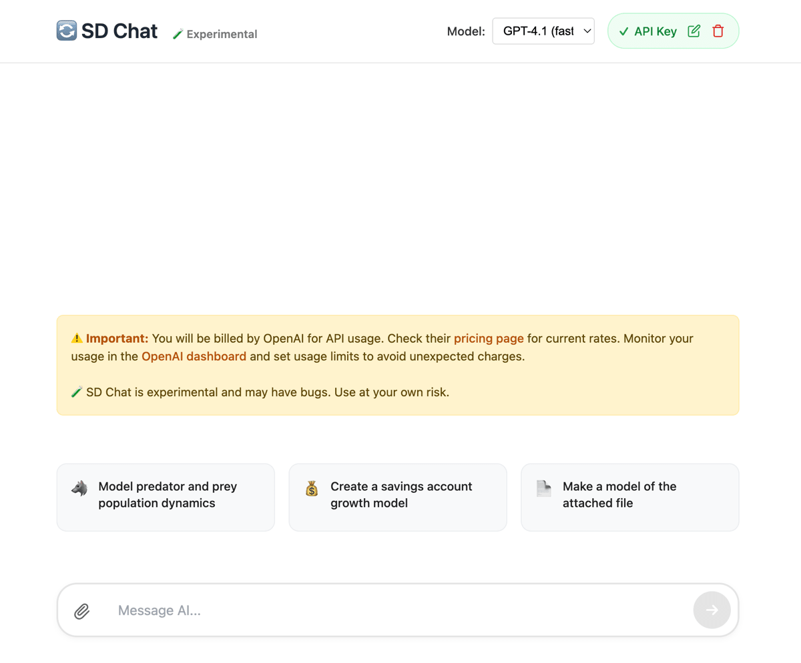
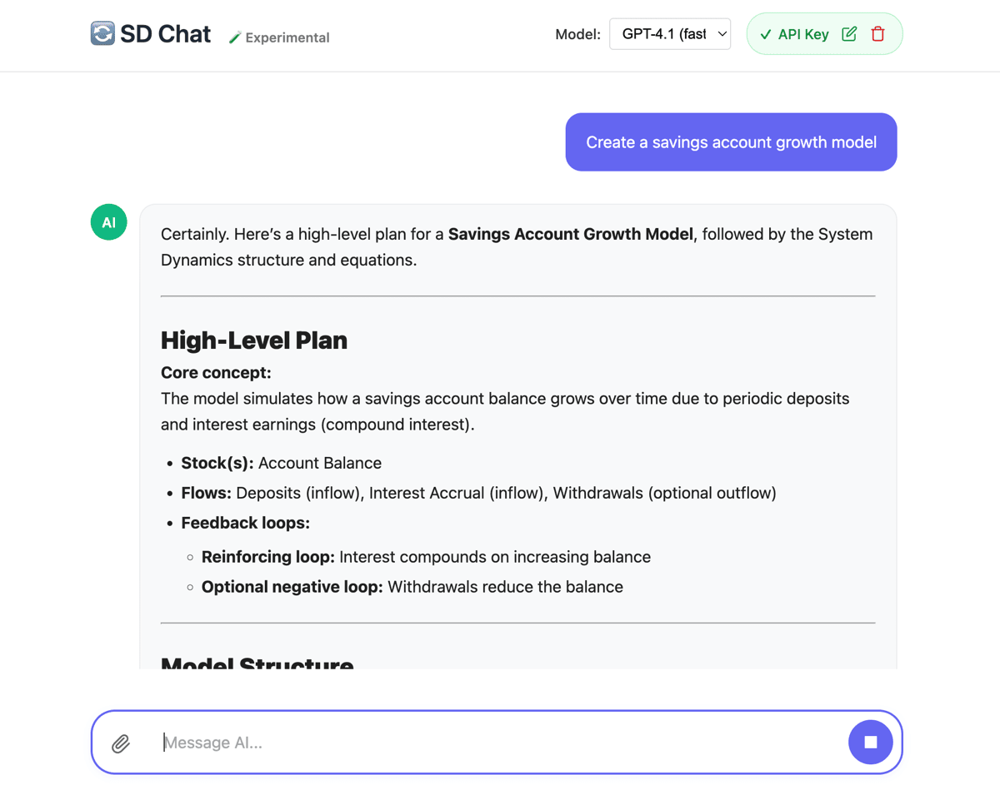
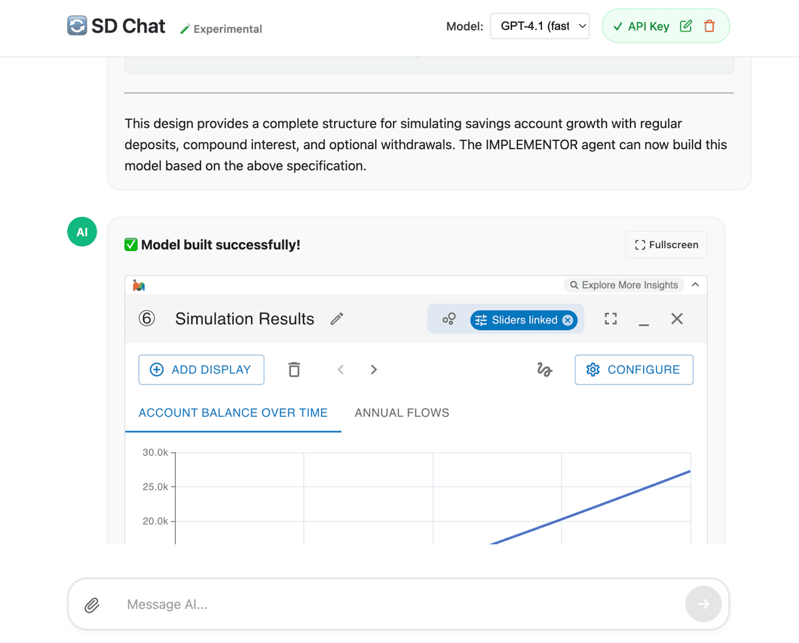

# SD Chat

This is an experimental proof-of-concept chat-based model builder.

🎥 Video Overview: https://share.descript.com/view/jV5kM1ZDIR9

It supports the following using a chat UI:

- Constructing models
- Analyzing and editing models
- Building models based on attached files, such as PDFs

It requires an OpenAI API key to run.

**WARNING** YOU WILL BE BILLED FOR ANY USAGE BY OPENAI. YOU ARE SOLELY RESPONSIBLE FOR ANY CHARGES.

**IMPORTANT** You should closely monitor your OpenAI API usage and set limits in the OpenAI dashboard to prevent unexpected charges.

SD Chat generates models in the [ModelJSON](https://github.com/scottfr/modeljson) format. SD Chat uses the [simulation npm package](https://github.com/scottfr/simulation) to automatically validate the generated models for certain classes of errors (like syntax errors). If the validation fails, it will automatically provide the error message to the LLM and have it attempt to fix the model.

It uses the OpenAI responses API and should support any models that API supports. By default, the model picker has GPT-4.1 and o3, but you can add other models. Usage of o3 will require you to complete a short verification process with OpenAI.

The o3 model is much better than the GPT-4.1 model.

Most of SD Chat was written using Claude Code. IT MAY HAVE BUGS. USE IT AT YOUR OWN RISK.

## SD Chat

👉 https://scottfr.github.io/sd-chat/

## Screenshots

